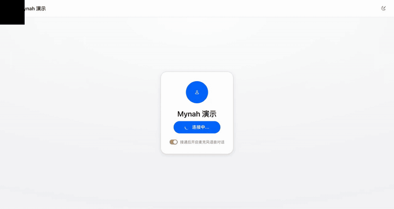
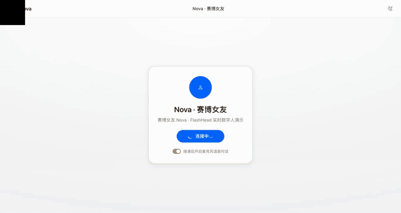

<div align="center">

<p align="center"></p>


**开源数字人，开箱即用：从引擎到交付，全部开源。**



<sub>公开演示频道实录：开口提问、唇形同步回答，随时可以插话打断。</sub>



<sub>FlashHead 引擎 + 内置半身预设 <b>Nova</b>：一张肖像，512 人脸贴回头到腰画布，待机呼吸在同一画布上烘焙。公开演示频道 <code>/channel/nova</code>。</sub>

实时语音对话、管理控制台、知识库、频道发布，一张显卡（或者没有显卡）。
默认 TTS 为 **EdgeTTS 免费档**（零配置、不占显存、需联网），最佳实践是本地 Qwen3-TTS（可克隆音色）或云端 key，控制台里热切换。
文档站：https://honwee.github.io/mynah/zh/

**开源、可嵌入的实时数字人引擎 — 全功能开放，无企业版墙。**

WebRTC 流式对话数字人：语音进、唇形同步视频出;形象/TTS/ASR/LLM 引擎可插拔,
支持视频训练新形象、声音克隆,一条命令的开箱引导。

[English](README.md) · [快速开始](#快速开始) · [商业支持](#商业支持) · [许可](LICENSING.md)

</div>

> **硬件门槛先说清楚**:默认 FlashHead 形象引擎需要 **NVIDIA GPU(4090 级)**;
> 轻量 wav2lipLS 路径可跑在更小的卡上。**一个形象 worker 同时服务一路会话**,
> 部署规划请先读英文 README 的 Capacity & scaling 章节。完全没有 GPU?
> 每个组件都可以指向远程 API。

## 是什么

`cored`(Go 实时核心)通过 WebRTC 向浏览器推送音画同步的数字人流:接收
offer → 与 Python 形象引擎建立 gRPC 会话 → 喂入 TTS 音频(文本直驱或 LLM
对话)→ 按 25fps 帧栅格回推 VP8/H.264+Opus。接上 ASR worker 和语义轮次
检测(判断用户"是否真说完了")即是完整的语音对语音闭环。`--db` 启用管理
控制台:配置热生效、知识库 RAG、可发布的访客频道。

全功能开源:**形象训练(传视频→提取最佳说话基底→可选用)、待机烘焙、
声音克隆、动作骨架库、RAG 精排**都在这一个 Apache-2.0 仓库里。

## 快速开始

最快路径是开箱引导(自动检测/一键安装每个组件,国内网络友好——HF 镜像 +
ModelScope):

```bash
python3 deploy/setup/helper.py        # → http://127.0.0.1:9500
```

或手动 Docker Compose(见 `deploy/compose/README.md`):

```bash
cd deploy/compose
cp .env.example .env && $EDITOR .env
bash setup-flashhead.sh
docker compose up -d --build
```

## 合规提醒

形象训练/声音克隆接口**强制 consent 授权字段**。克隆真人形象/声音属于
"深度合成",在中国大陆等司法辖区受专门监管——部署前请读
[docs/compliance.md](docs/compliance.md)。

## 商业支持

引擎永久免费(Apache-2.0)。需要生产落地帮助的团队,我们提供付费服务:
部署与调优、定制形象/音色、集成开发、托管运行。在 issue 区加 `commercial`
标签或通过仓库主页联系方式找到我们。<!-- TODO: 替换为直接联系方式 -->

## 更多

架构、API、引擎契约、能力清单见英文 [README.md](README.md);
安全部署见 [SECURITY.md](SECURITY.md);贡献指南见 [CONTRIBUTING.md](CONTRIBUTING.md)。
